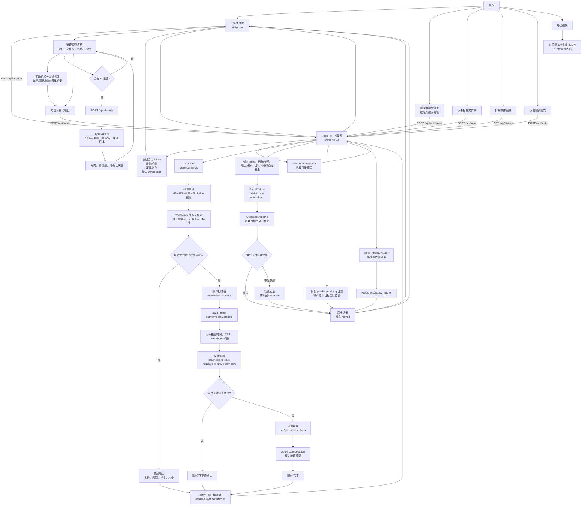

# 整体流程图

项目是一个本机运行的 React + Vite 前端和 Node.js 文件整理服务。浏览器只负责状态和预览，文件扫描、路径校验、移动、日志和撤销都由 Node 完成。

## 关键边界

- 浏览器不会直接操作本机文件；所有文件操作都经过 Node API。
- AI 只接收普通文件/文件夹的名称、扩展名、大小和少量目录样本，不读取文件内容。
- 媒体元数据优先在本机 Swift helper 中读取；只有用户打开地点查询时，GPS 才会发送给 Apple 解析国家和城市。
- 移动前后都使用文件身份、真实路径和符号链接检查，并以操作日志支持恢复和撤销。
- Live Photo 的照片和视频只有在共享唯一标识时才成组移动，否则分别作为普通媒体处理。
